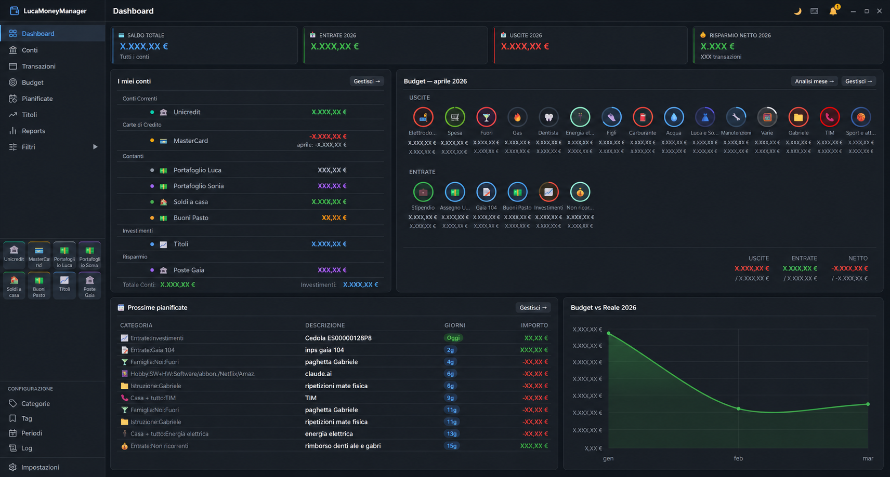
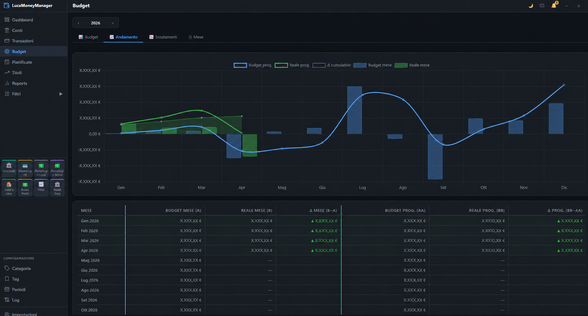
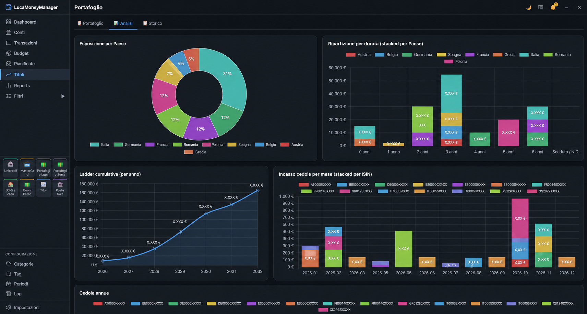
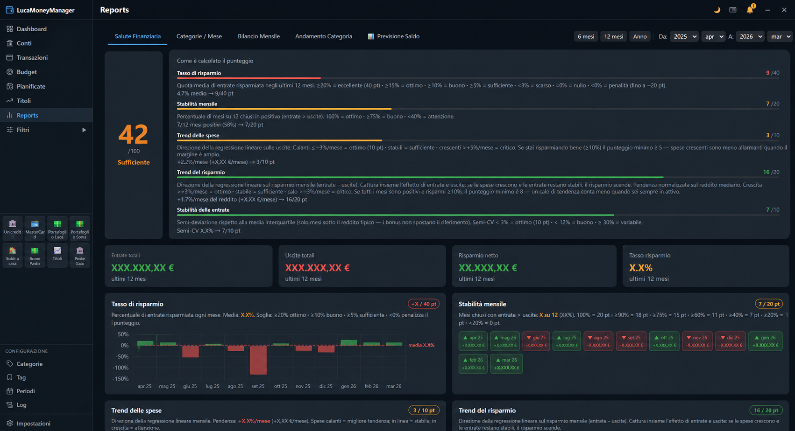

# LucaMoneyManager

A personal finance desktop application built with Java + Chromium (JCEF), backed by a SQLite database shared across devices via OneDrive. Available on **Windows** (primary) and **Android** (companion app).



---

## Features

### Dashboard
The home screen gives a full picture of your finances at a glance:
- **Account balances** — all accounts shown with current balance, grouped by type
- **Budget widget** — current month's spending bubbles per category, with totals (actual vs. budget) for expenses, income, and net
- **Upcoming scheduled transactions** — next recurring payments and income, with due dates
- **Recent transactions** — latest movements across all accounts
- **Budget vs Reality chart** — monthly trend comparing planned vs. actual net balance

### Accounts
- Multiple account types: checking, savings, credit card, cash, investment, loan
- Custom emoji icons, colors, and currency per account
- Balance history tracking
- Reconciliation workflow (verified / unverified transactions)

### Transactions
- Full CRUD for income, expenses, and transfers
- **Split transactions** — split one transaction across multiple categories
- **Tags** — free-form labels with colors for cross-category grouping
- **Attachments** — link files (receipts, invoices) to a transaction
- **Reconciliation status** — mark transactions as verified or pending
- Inline editing, keyboard shortcuts, and context menu actions
- Filters by date range, account, category, type, tag, reconciliation status
- **Portfolio link badge** — transactions linked to a portfolio position are clearly marked

### Categories
- Hierarchical structure (parent → child)
- Custom icon and color per category
- Separate trees for expenses and income

### Budget



- **Monthly and annual budgets** per category with master-amount support
- Four views:
  - **Grid** — full year at a glance, inline editing per cell
  - **Trend** — budget vs. actual chart with cumulative lines and monthly bars
  - **Deviations** — ranked list of over/under-budget categories
  - **Month** — detailed breakdown for a single month with progress bars
- Sticky multi-row header for easy scrolling through 12 months
- Quick filters: only red (over budget), only current month
- Bulk budget generation from historical averages

### Scheduled Transactions
- Recurring transactions with configurable frequency (daily, weekly, monthly, yearly, etc.)
- Start and end dates, active/inactive toggle
- **Overdue notice** — badge alert when a scheduled transaction is past due
- **Forecasts** — future balance projection based on scheduled items
- Linked to portfolio positions when applicable

### Portfolio



- Track stocks, ETFs, bonds and other financial instruments by ticker
- Buy / sell / dividend / expense operations per position
- Charts:
  - **Exposure by ticker** — donut chart of portfolio allocation
  - **Annual return by ticker** — stacked bar chart per year
  - **Cumulative return** — total portfolio value over time
  - **Dividends per ticker per month** — bar chart breakdown
- Realized and unrealized gain/loss per position

### Reports



- **Financial health score** — composite metric with breakdown and suggestions
- Spending trend by top categories with mini sparkline charts
- **Savings rate** — monthly and rolling average
- Month-by-month expense analysis
- Cross-filters by category tree, date range, and year
- Powered by Chart.js with responsive rendering

### Settings
- **Themes** — dark, light, and fully customizable color themes
- **Backup** — automatic backup on close with configurable directory and retention count
- **Attachments** — configurable storage directory
- **HTTP server** — optional LAN web server for remote access
- **Autostart** — launch with Windows
- **Keyboard shortcuts** reference panel
- Database info and manual backup trigger

---

## Architecture

```
JS Frontend (Vanilla JS, ~8000 LOC)
    ↓  cefQuery (JSON payload, Base64-encoded)
Bridge.java — dispatches 40+ operations
    ↓
Database.java — all JDBC queries
    ↓
SQLite (schema v12, 13+ tables)
```

**Tech stack:**
- Java 21, Maven
- JCEF v143 (Chromium Embedded Framework)
- Swing (window chrome, system tray, dialogs)
- SQLite via JDBC
- Chart.js (charts)
- No JS framework — pure Vanilla JS

**Database tables:** `accounts`, `categories`, `transactions`, `transaction_splits`, `transaction_tags`, `tags`, `budgets`, `budget_config`, `scheduled_transactions`, `portfolio`, `portfolio_transactions`, `app_settings`, `schema_version`, `sync_meta`

---

## Android companion app

A lightweight Android app (Kotlin, Material Design 3, min SDK 26) sharing the same SQLite database via OneDrive:
- Account balance overview with favorites
- Quick transaction entry with category picker
- Home screen widget (account balances)
- Periodic background sync via WorkManager

---

## Build

```bash
mvn package
```

Output: `target/moneymanager-*.jar` (fat JAR, includes all dependencies)

**Requirements:** Java 21+, Maven 3.x
